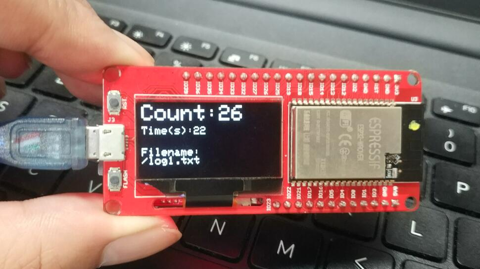

# WiFi-Statistics


```
/*
Version:		V2.0
Author:			Vincent
Create Date:	2020/9/16
Note:
	V2.0 : Add IoT function, push data to ThingSpeak.com.
*/
```


[toc]

# OVERVIEW


## Intruduce

[Makerfabs home page](https://www.makerfabs.com/)

[Makerfabs Wiki](https://makerfabs.com/wiki/index.php?title=Main_Page)

In fact ,this is a wifi sniffer. It sniffs out the wifi signals of smartphones in its range to make a rough count of traffic. Compared to the camera, or security door, smaller, hidden, easy to carry.
This project is changed from [ESP-EOS/ESP32-WiFi-Sniffer](https://github.com/ESP-EOS/ESP32-WiFi-Sniffer)


## Equipment list

- [MakePython ESP32](https://www.makerfabs.com/makepython-esp32.html)
- [MakePython A9G GPRS/GPS Expansion](https://www.makerfabs.com/makepython-a9g-gprs-gps-shield.html)

SD card reader modules such as MakePython Audio are available, but require pin changes.

- Micro SD Card


# STEPS

## Prepare And Burn

**If you have any questions，such as how to install the development board, how to download the code, how to install the library. Please refer to :[Makerfabs_FAQ](https://github.com/Makerfabs/Makerfabs_FAQ)**

- Connect ESP32 to PC .
- Use Arduino upload .ino file in "/Project_WiFi-Statistics/wifi_probe".
- Insert a micro SD card.
- GPRS SIM Card.(If you need IoT function.)
- Restart ESP32.
- Wait a moment ,Lcd screen will show some data.


## People Counting 

- Connect to mobile power/lithium battery.
- If "Card Mount Failed" appears, you need to replug the SD Card and restart it.


- If all goes well, the LCD screen displays detail data.




## Analysis Data

- Copy the SD card TXT file beginning with "log" into the project folder.
- Use command line, run wifi_count.py.
- A line diagram of the time and surrounding terminal relationships is displayed.


## IoT Function

IoT funcgtion have now been added. Data can be transmitted to Internet of Things websites in real time. You can see historical traffic curves at ThingSpeak.com.

- Get a ThingSpeak™ account.


- Create a channel for collecting data. 


- Set channel, like name and some params.


- And system will give you two api_keys. Upload need write key.


- Change code, add your write api_key. Mine is "2ZOQP7ZGJ9OVGU6X".

```c++
String command = "AT+HTTPGET=\"http://api.thingspeak.com/update?api_key=2ZOQP7ZGJ9OVGU6X&field1=";
```

- Uncomment  “#define THINGSPEAK”

```c++
//#define THINGSPEAK

#ifdef THINGSPEAK

#define DEBUG true //true: debug on; false:debug off
bool SIM800C_ON = false;
int my_index = 0;

#define MP_RX1 21
#define MP_TX1 22

#define A9G_POWER 27
#define A9G_RST 33

#endif
```

- Upload code to ESP32.
- Insert a SIM card, need support GPRS.
- Restart ESP32, wait a moment.
- If upload successfully, webpage will show newest data.

