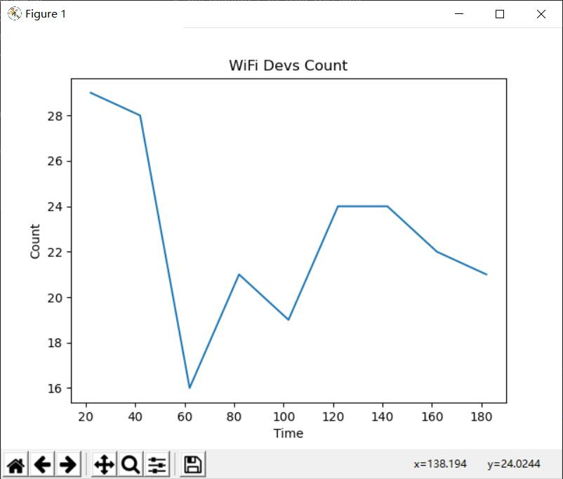

# WiFi-Statistics


```
/*
Version:		V1.0
Author:			Vincent
Create Date:	2020/9/16
Note:
*/
```


[toc]

# OVERVIEW


## Intruduce

[Makerfabs home page](https://www.makerfabs.com/)

[Makerfabs Wiki](https://makerfabs.com/wiki/index.php?title=Main_Page)

In fact ,this is a wifi sniffer. It sniffs out the wifi signals of smartphones in its range to make a rough count of traffic. Compared to the camera, or security door, smaller, hidden, easy to carry.
This project is changed from [ESP-EOS/ESP32-WiFi-Sniffer](https://github.com/ESP-EOS/ESP32-WiFi-Sniffer)


## Equipment list

- [MakePython ESP32](https://www.makerfabs.com/makepython-esp32.html)
- [MakePython A9G GPRS/GPS Expansion](https://www.makerfabs.com/makepython-a9g-gprs-gps-shield.html)

SD card reader modules such as MakePython Audio are available, but require pin changes.

- Micro SD Card


# STEPS

## Prepare And Burn

**If you have any questions，such as how to install the development board, how to download the code, how to install the library. Please refer to :[Makerfabs_FAQ](https://github.com/Makerfabs/Makerfabs_FAQ)**

- Connect ESP32 to PC .
- Use Arduino upload .ino file in "/Project_WiFi-Statistics/wifi_probe".
- Insert a micro SD card.
- Restart ESP32.
- Wait a moment ,Lcd screen will show some data.


## People Counting 

- Connect to mobile power/lithium battery.
- If "Card Mount Failed" appears, you need to replug the SD Card and restart it.


- If all goes well, the LCD screen displays "count/time".


## Analysis Data

- Copy the SD card TXT file beginning with "log" into the project folder.
- Use command line, run wifi_count.py.
- A line diagram of the time and surrounding terminal relationships is displayed.

